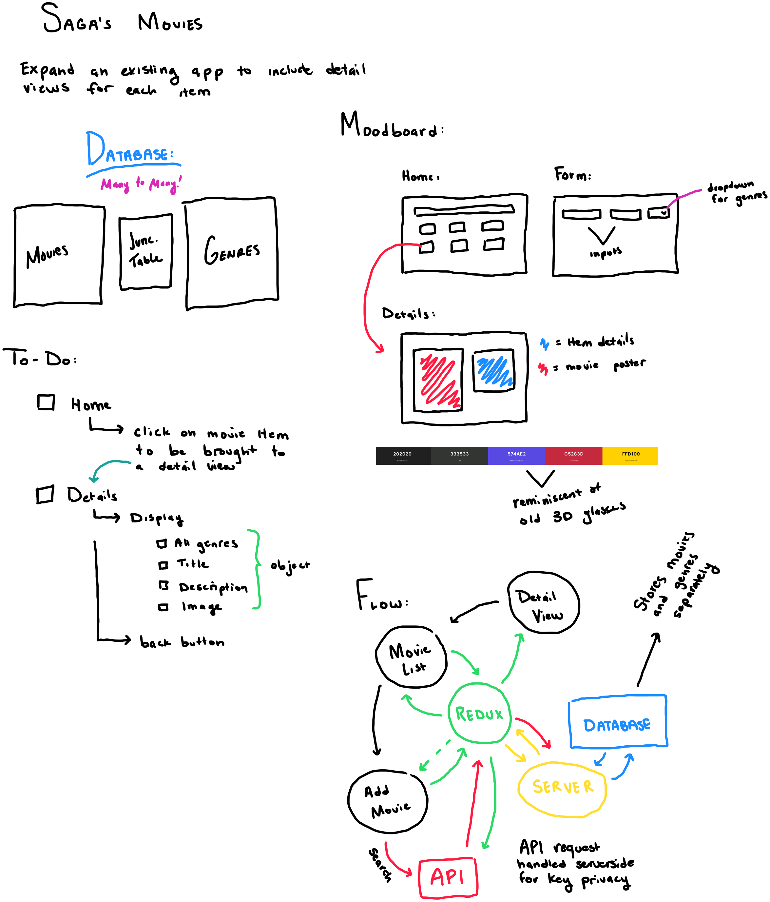

# The Movies Saga:

## Description

_Duration: 16 hour Sprint_

Over the course of a weekend we were tasked with using our knowledge of Redux, React, SQL Joins, and Sagas in order to refactor an app - and add a Detail view for each movie in their database. 

## Screen Shots
All screenshots available in the [Wireframes](https://github.com/blakesmithmn/weekend-movie-sagas/tree/main/wireframes)

## Description & Approach

As I continue to develop my personal workflow - I am trying to get into the habit of breaking down the complexity of the project at hand. One way I do this is by making a visual To-Do list / Flow Chart for me to follow. (like the one below). 

In this particular assignment - I found this useful to try and break down the task at hand into manageable React Components, and visualize the Database table relationships.

### Prerequisites
- [Node.js](https://nodejs.org/en/)
- React.js
- Axios
- Redux
- Redux-Saga
- [Material.UI](https://mui.com)
- Express 
- Body-Parser
- 'PG'
- Database Manager

## Installation
1. Clone this repository for your own access.
2. Open up your editor of choice and run an `npm install`
3. Using the provided `data.sql` file - set up a database.
4. Open two Terminal Tabs
5. Run `npm run server`  and `npm run client`in your terminal
6. Navigate to http://localhost:3000/

## Usage
This web application is meant to serve as a tool to view and save movies:
 1. Using the provided movies on the home page - `click` the movie of your choice to see the details.
 2. Once done, navigate back to the home page using either the navigation bar - or the provided `back` button.
 3. If you wish to add your own movie - navigate to `search` using the provided navigation bar.
 4. In the search form - enter the movie title to search the Movie Database API.
 5. Use the `Add to Favorites` button to add the movie of your choice to the Movielist! 
 6. If you wish to share a movie with your friends - the detail view of each movie should link them directly!

## Developer Notes

Given the opportunity to revisit this project - I would love to finish the development of the genre modification dropdown. 

In the form to add more movies - I anticipated user error and decided to integrate an API in order to fetch movie information for the user. The API pulls in Movie Title, Poster, and Description based off of a keyword search.

## Acknowledgement
Thanks to [Prime Digital Academy](www.primeacademy.io) who equipped and helped me to make this application a reality.

Thanks to [The Movie Database](https://www.themoviedb.org) for providing access to their API - which supplied information for multiple parts of this application. 